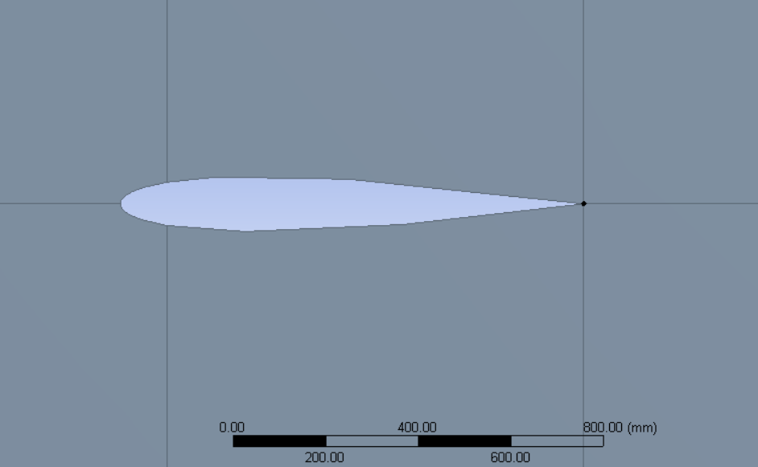
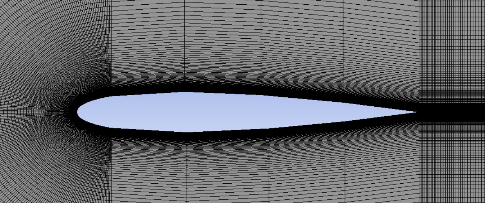
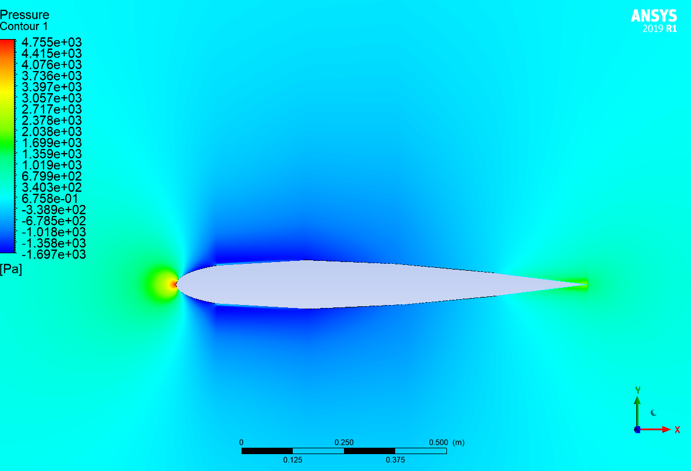
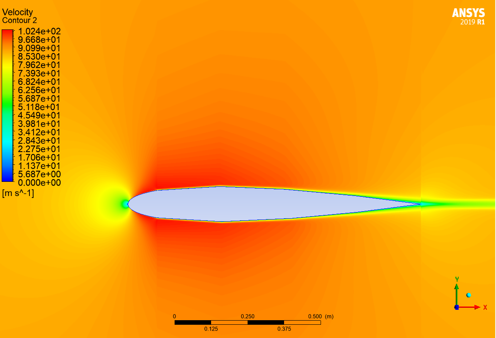
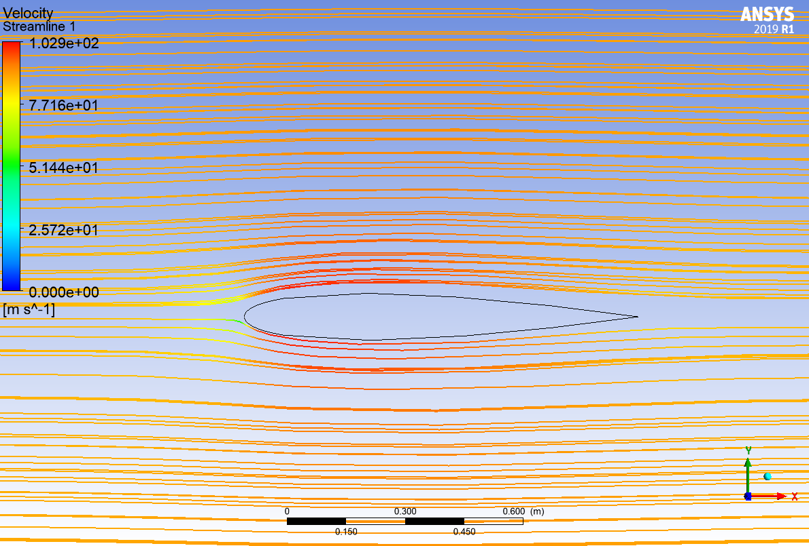
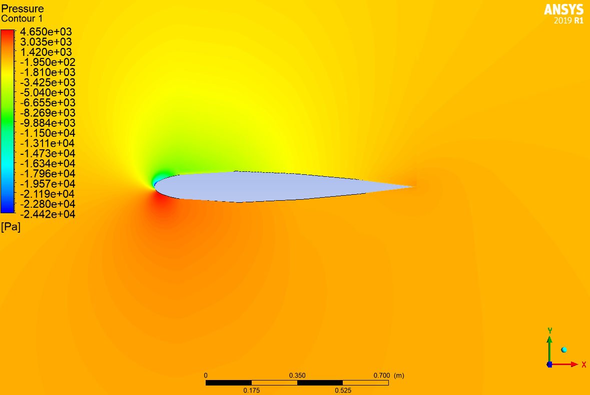
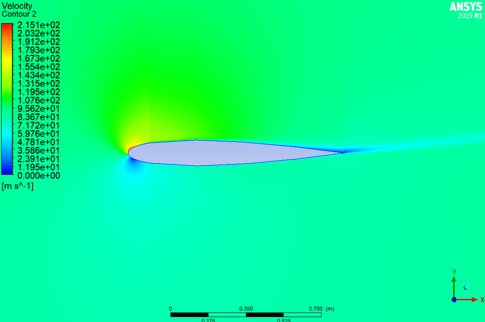
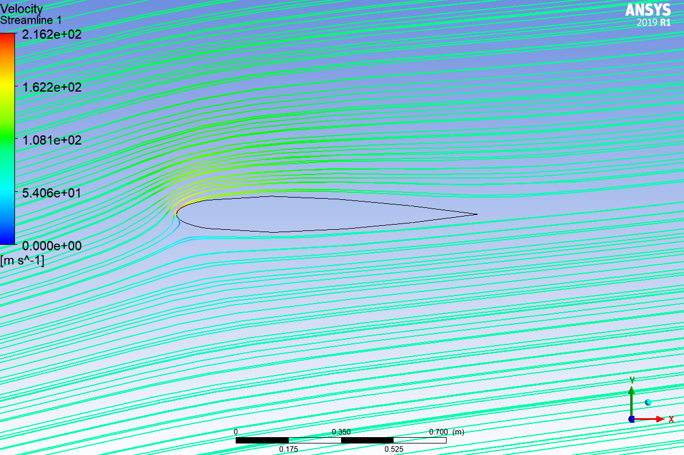
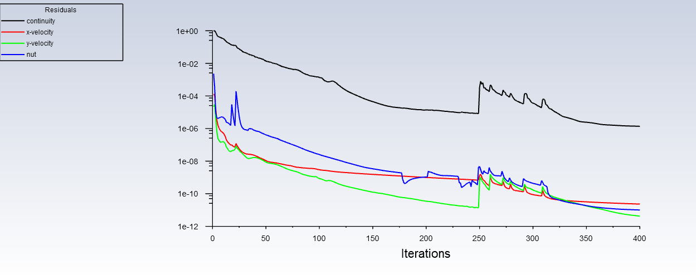

# CFD Analysis of NACA 0012 Airfoil Using ANSYS Fluent

> **Computational Fluid Dynamics (CFD) simulation of the NACA 0012 airfoil to evaluate aerodynamic performance through lift and drag analysis at 0° and 10° angles of attack using ANSYS Fluent.**

---

## 📖 Project Overview

This project presents a **Computational Fluid Dynamics (CFD)** analysis of the **NACA 0012 airfoil** using **ANSYS Fluent**. The objective is to investigate the aerodynamic behavior of the airfoil by determining the **lift** and **drag** characteristics at two different angles of attack:

- **0° Angle of Attack**
- **10° Angle of Attack**

The simulation includes geometry preparation, mesh generation, boundary condition definition, solver configuration, convergence monitoring, and post-processing to analyze the pressure, velocity, and aerodynamic coefficients.

---

## 🎯 Objectives

- Model the NACA 0012 airfoil in ANSYS.
- Generate a high-quality computational mesh.
- Perform steady-state CFD simulations using ANSYS Fluent.
- Evaluate the lift coefficient (**Cl**) and drag coefficient (**Cd**) at:
  - 0° Angle of Attack
  - 10° Angle of Attack
- Compare aerodynamic performance at both operating conditions.
- Visualize pressure and velocity distributions around the airfoil.

---

## 🛠️ Software Used

| Software | Purpose |
|----------|----------|
| **ANSYS Workbench** | Project setup |
| **ANSYS DesignModeler / SpaceClaim** | Geometry creation |
| **ANSYS Meshing** | Mesh generation |
| **ANSYS Fluent** | CFD simulation |
| **Microsoft Excel / MATLAB (Optional)** | Data analysis |

---

# 📐 Geometry

The simulation domain consists of a **2D NACA 0012 airfoil** placed inside a computational fluid domain suitable for external aerodynamic analysis.

### Geometry Preview

---

# 🕸️ Mesh

A structured/refined mesh was generated around the airfoil with increased mesh density near the airfoil surface to accurately capture the boundary layer and flow gradients.

### Mesh Preview

> **Placeholder:** Replace with mesh image.

---

# ⚙️ Simulation Setup

## Solver

- Pressure-Based Solver
- Steady-State Analysis
- 2D Simulation

## Fluid

- Air

## Boundary Conditions

| Boundary | Condition |
|----------|-----------|
| Inlet | Velocity Inlet |
| Outlet | Pressure Outlet |
| Airfoil | No-slip Wall |
| Top & Bottom | Far-field / Symmetry |

---

## Turbulence Model

> **Replace with your turbulence model**

Example:

- SST k-ω
- Standard k-ε
- Spalart-Allmaras

---

## Operating Conditions

| Parameter | Value |
|-----------|------|
| Fluid | Air |
| Flow Type | Incompressible |
| Angle of Attack | 0°, 10° |

---

# 📊 Results

## Case 1 — 0° Angle of Attack

### Pressure Contour

> Placeholder

---

### Velocity Contour

> Placeholder

---

### Streamlines

> Placeholder

---

## Case 2 — 10° Angle of Attack

### Pressure Contour

> Placeholder

---

### Velocity Contour

> Placeholder

---

### Streamlines

> Placeholder

---

# 📈 Residual Convergence

Residual plots were monitored throughout the simulation to ensure numerical convergence.

> Placeholder

---

# 📋 Aerodynamic Performance

| Angle of Attack | Lift Coefficient (Cl) | Drag Coefficient (Cd) |
|----------------|-----------------------|-----------------------|
| 0° | *5.6661116145e-04* | *1.2797767341e-02* |
| 10° | *To be added* | *To be added* |

---

# 🔍 Key Observations

- Lift increased significantly with increasing angle of attack.
- Drag also increased due to greater flow resistance.
- Pressure distribution became more asymmetric at 10°.
- Higher velocity gradients were observed around the upper surface of the airfoil.
- Flow remained attached under the simulated operating conditions *(modify if separation occurred).*

---

# 📷 Project Gallery

### Geometry

---

### Mesh

---

### Pressure Contours

---

### Velocity Contours

---

### Streamlines

---

# 🚀 Skills Demonstrated

- Computational Fluid Dynamics (CFD)
- ANSYS Fluent
- ANSYS Meshing
- External Aerodynamics
- Lift & Drag Analysis
- Mesh Generation
- Boundary Condition Setup
- Numerical Simulation
- Flow Visualization
- Engineering Data Analysis

---

